# Credit Card Pattern Matching — PDC Project

**Submitted To:** Sir Ehtisham Ul Haque · **Submitted By:** Syed Muhammad · **Reg. No:** SP22-BCS-034

Credit card validation and issuer-network detection, with three interchangeable
processing engines. The entire system from `PDC_Project.ipynb` — all seven menu
options — runs as a React single-page app in the browser. No backend, no
install beyond `npm install`, no data leaves the page.

The original notebook stays in the repository, unchanged.


---

## Quick start

```bash
cd web
npm install
npm run dev
```

Open the URL Vite prints (http://localhost:5173/).

| Command | What it does |
|---|---|
| `npm run dev` | Development server with hot reload |
| `npm run build` | Typecheck and build to `web/dist` |
| `npm run preview` | Serve the production build |
| `npm run verify` | Run the logic regression check (84 assertions) |

Requires Node.js 18+. Nothing else.

---

# Screens

The notebook's main menu had eight options. Seven map one-to-one onto tabs;
option 8 was "Exit", which a web page does not need.

## 1 · Interactive Mode

One card through all four checks — Luhn checksum, CVV, expiry, and the prefix
pattern table. Results update as you type. The eight brand chips load a valid
sample number for each network.


Grouping and CVV width follow the detected network. American Express prints as
**4-6-5** with a **4-digit** CID, not 4-4-4-4 with 3:


A number whose prefix fits a network but whose length does not says which
network and why, instead of failing silently:


Dark mode is a selected palette, not an inverted one:

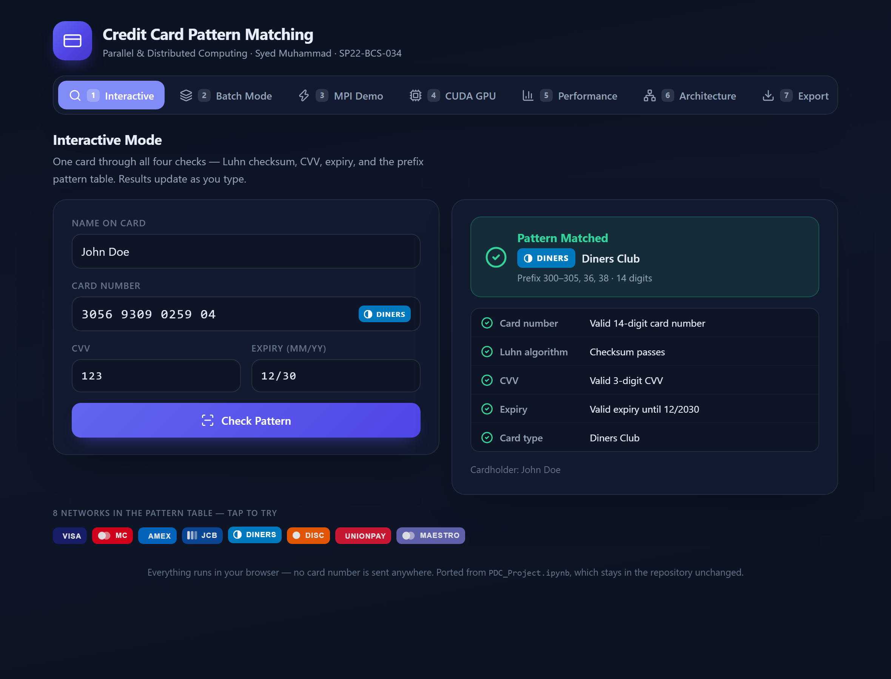

## 2 · Batch Mode

Generate test data or type cards in by hand, choose an engine, and process.
Every completed run is recorded for the Export view.

Generated batch of 20,000 cards through the MPI engine — the distribution bar
shows all eight networks coming back:


Manual entry, one row per card:


The **deliberately invalid** slider breaks a chosen share of the batch's Luhn
checksums, so the invalid path is visible too — here 35% of 5,000 cards:


## 3 · MPI Parallel Processing Demo

The master splits the batch, scatters one chunk to each rank, and gathers the
results back in rank order.

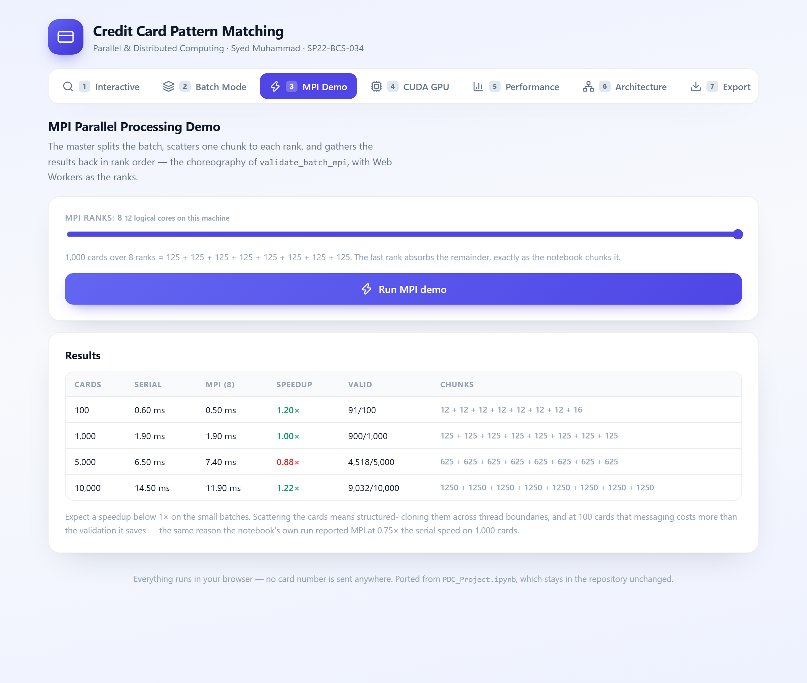

The rank count is adjustable, and the readout shows the resulting split —
the last rank absorbs the remainder, exactly as the notebook chunks it:

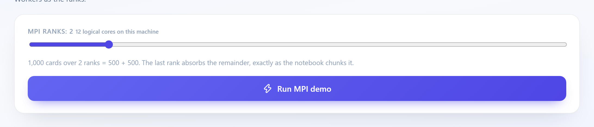

## 4 · CUDA GPU Simulation

The GPU timing is modelled, and the page says so before showing any number:

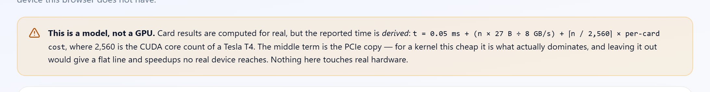

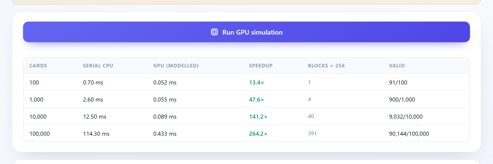

The kernel `generate_cuda_kernel_code()` emits, reproduced verbatim:

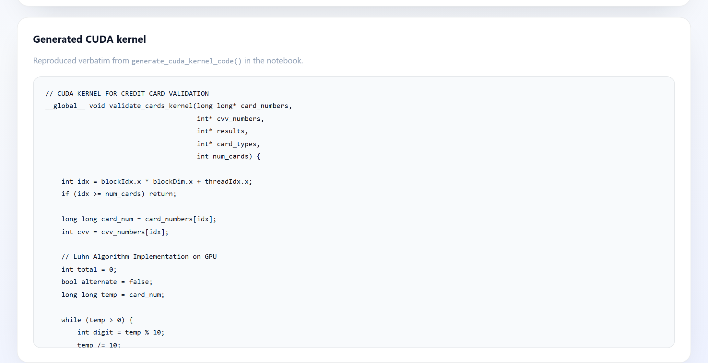

…and the defects in it, worth knowing before quoting it in a report:

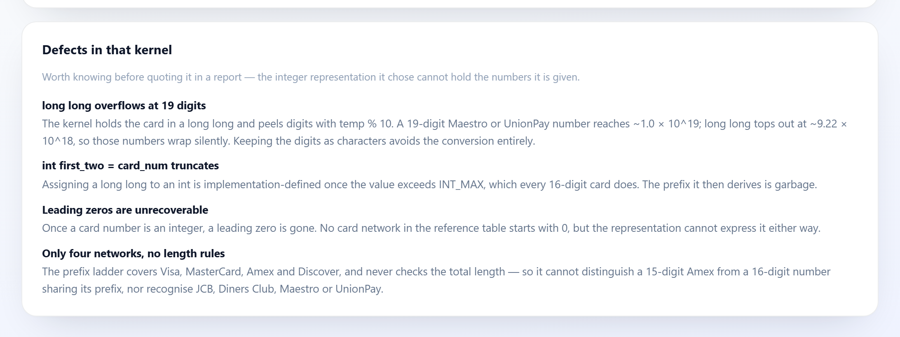

## 5 · Performance Analysis

All three engines over the same batches, 100 to 50,000 cards, on log-log axes.


The chart carries a hover readout, a legend, and a direct label per series:

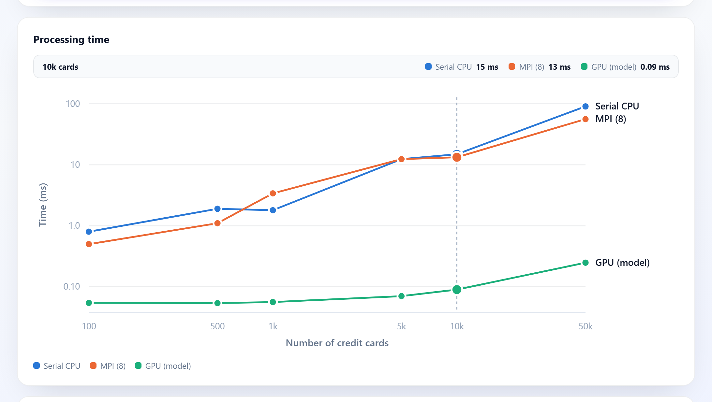

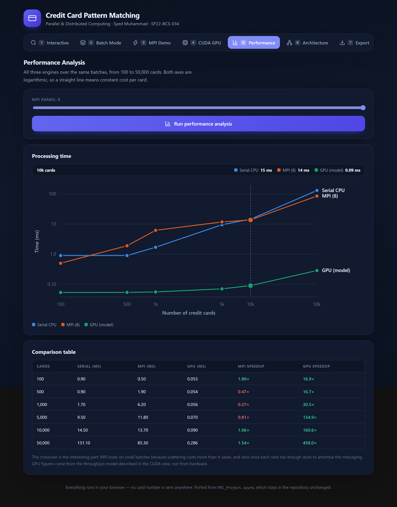

## 6 · System Architecture

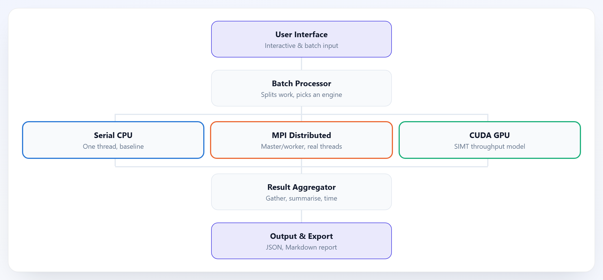

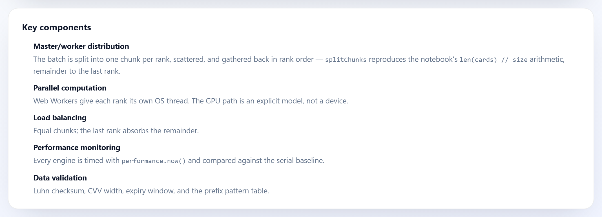

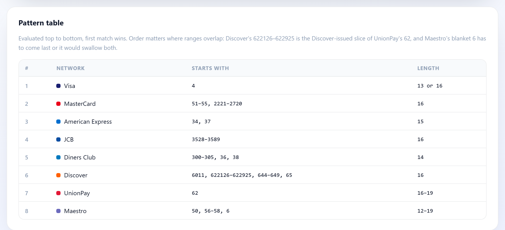

## 7 · Export Results

The same three artefacts the notebook's export step produces — a results JSON,
a sample-data JSON, and a Markdown report — as browser downloads.

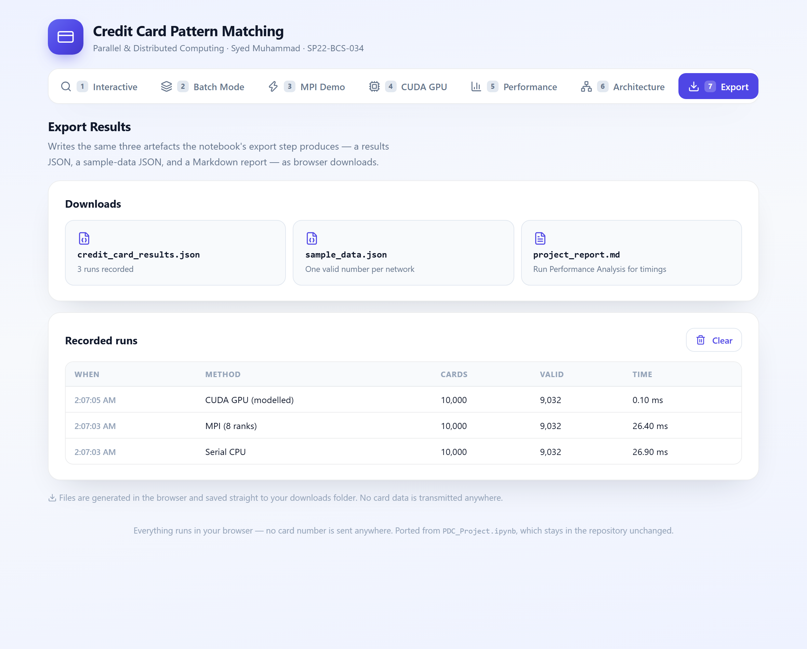

## Responsive

Phone (390 px), tablet (820 px):

| Interactive | Performance |
|---|---|
| 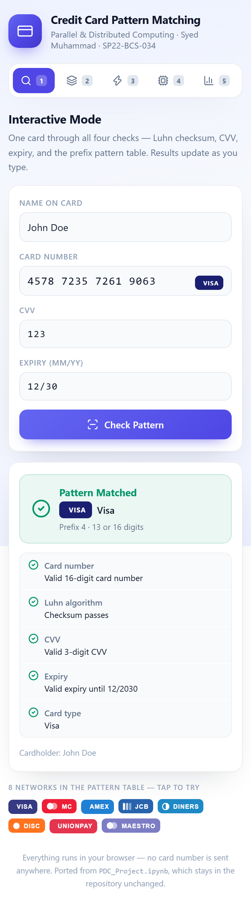 | 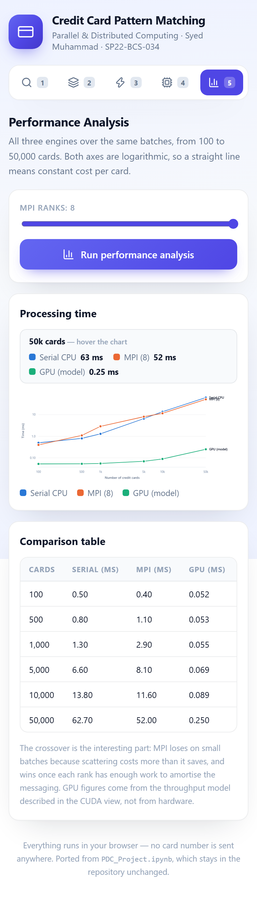 |

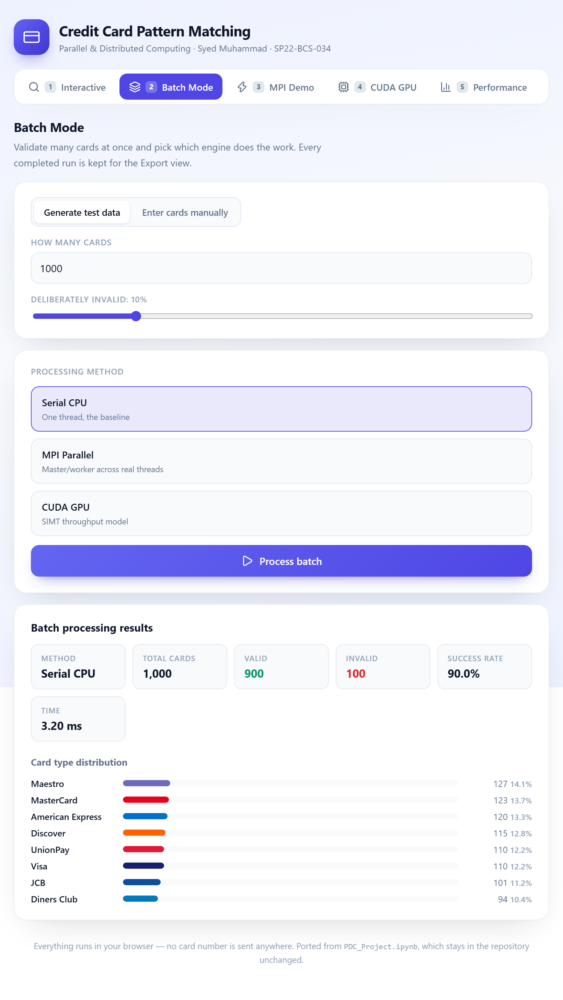

---

# The algorithm

`web/src/core/validation.ts` is a direct port of `CreditCardSystem` from the
notebook (STEP 2), function for function:

| Notebook | Port |
|---|---|
| `validate_card_number` | `validateCardNumber` — Luhn checksum + length |
| `validate_cvv` | `validateCvv` |
| `validate_expiry` | `validateExpiry` |
| `detect_card_type` | `detectCardType` / `matchBrand` |
| `generate_test_data` | `generateTestData` |
| `run_serial_validation` | `runSerial` |
| `validate_batch_mpi` | `runMpi` |
| `validate_batch_gpu` | `runGpu` |

## Prefix matching

The notebook tests prefixes in exactly two shapes:

```python
card_number.startswith('4')            # first 1 digit  == 4
51 <= int(card_number[:2]) <= 55       # first 2 digits in [51, 55]
```

Both are the *same operation*: slice the leading digits, read them as an
integer, test a closed range. A `startswith` is just the range where
`from === to`. So the port expresses that one comparison as data:

```ts
type PrefixRange = { digits: number; from: number; to: number };

{ digits: 1, from: 4,  to: 4  }   // startswith('4')
{ digits: 2, from: 51, to: 55 }   // 51 <= int(n[:2]) <= 55
```

Adding a network is a new row in the table, not a new branch in the code.
**There is no regex anywhere in the brand detection path.** Brands are
evaluated in order, first match wins — the same control flow as the notebook's
`if`/`elif` chain.

## Card networks

| # | Network | Starts with | Length | In original notebook |
|---|---|---|---|---|
| 1 | Visa | 4 | 13 or 16 | Yes — 16 only |
| 2 | MasterCard | 51–55, 2221–2720 | 16 | Partly — 51–55 only |
| 3 | American Express | 34, 37 | 15 | Present but unreachable |
| 4 | JCB | 3528–3589 | 16 | **Added** |
| 5 | Diners Club | 300–305, 36, 38 | 14 | **Added** |
| 6 | Discover | 6011, 622126–622925, 644–649, 65 | 16 | Partly — matched any `6` |
| 7 | UnionPay | 62 | 16–19 | **Added** |
| 8 | Maestro | 50, 56–58, 6 | 12–19 | **Added** |

Order matters where ranges overlap:

- **Discover before UnionPay** — `622126–622925` is the Discover-issued slice
  of the `62` range, so the narrower six-digit rule is tested first.
- **Discover and UnionPay before Maestro** — `6011`, `65`, `644–649` and `62`
  are all also covered by Maestro's blanket `6`. Maestro sits last for the same
  reason the notebook kept its own `startswith('6')` catch-all last.

---

# What changed from the notebook, and why

Five deliberate deviations. Everything else is a faithful port.

**1. American Express could never match.** `validate_card_number` gates on
`^\d{16}$`, and Amex numbers are 15 digits — so they were rejected before
`detect_card_type` ever ran. That branch was dead code. Length is now a
per-brand rule, which also makes Diners Club (14) and Maestro (12–19)
expressible.

**2. The test-data generator produced cards its own validator rejects.** It
picks a prefix from `['4', '5', '37', '6']` and always builds a 16-digit
number. Amex is 15 digits, so every `37` card — a quarter of every batch — was
a number no network issues. The notebook never noticed because its
`detect_card_type` ignores length. Prefix and length are now drawn together
from the brand table.

**3. Generated cards were born expired.** Expiry was
`randint(current_year, current_year + 5)` with a random month, so anything
landing on the current year with an earlier month was already invalid — about
10% of every batch. Months are now constrained when the year is the current
one.

**4. CVV is 4 digits for Amex.** The notebook requires exactly 3 for
everything. American Express prints a 4-digit CID.

**5. The GPU simulation no longer sleeps per card.** The notebook models the
GPU with `time.sleep(0.00001)` in a serial loop, which is a per-card *delay* —
it makes the "GPU" the slowest engine in the notebook's own results table
(0.1× speedup, slower than serial). See below for what replaced it.

---

# How the parallelism works

**Serial** is the baseline: one pass, one thread.

**MPI is real parallelism.** Each rank is a Web Worker on its own OS thread.
The master splits the batch with the notebook's own arithmetic
(`len(cards) // size`, remainder to the last rank), posts a chunk to each rank,
and gathers the results back in order. `postMessage` structured-cloning stands
in for MPI's send/recv. The timings are measured, not modelled.

Expect a speedup **below 1× on small batches** — scattering cards across thread
boundaries costs more than the validation it saves until each rank has enough
work to amortise it. That is the same effect the notebook's own run reported
(MPI at 0.75× serial on 1,000 cards), and the crossover point is the
interesting result.

**GPU is a model, and says so wherever it appears.** Card results are computed
for real; the reported *time* is derived:

```
t = 0.05 ms  +  (n × 27 bytes ÷ 8 GB/s)  +  ⌈n ÷ 2560⌉ × per-card cost
    ↑ launch    ↑ PCIe transfer            ↑ SIMT rounds (T4 CUDA cores)
```

The transfer term matters: for a kernel this cheap the PCIe copy is what
actually dominates, and leaving it out gives a flat line and speedups no real
device reaches.

**Timings are medians of three runs.** A single sample on a browser main thread
is badly behaved — one GC pause during the 1,000-card run puts a spike in the
chart that reads as a property of the algorithm rather than of the runtime.

---

# Testing

```bash
cd web && npm run verify
```

84 assertions, no test framework — a plain script bundled for Node:

- The notebook's own STEP 7 quick test, checked against its recorded output
- One case per rule branch in the pattern table, all eight networks
- Boundary rejections either side of every numeric range (`2220`/`2721`,
  `3527`/`3590`, `306`), and per-brand length rules
- All four validators, including Amex CVV width and expiry edge cases
  (same year/earlier month, same year/same month, month 13)
- `generateTestData`: every card Luhn-valid, brand-legal length, future expiry,
  deterministic per seed, and `invalidRate` breaking the right share
- Chunking matches the notebook's arithmetic, and gathering preserves order
- Serial and GPU engines produce byte-identical results

---

# Project layout

```
.
├── PDC_Project.ipynb            # original coursework notebook (unchanged)
├── docs/screenshots/            # the 23 images above
└── web/
    ├── package.json
    ├── scripts/verify-logic.ts  # the regression check
    └── src/
        ├── App.tsx              # shell + the seven tabs
        ├── store.tsx            # recorded runs, for the Export view
        ├── core/
        │   ├── validation.ts    # Luhn, CVV, expiry, prefix matching
        │   ├── cardBrands.ts    # the pattern table
        │   ├── engines.ts       # serial / MPI / GPU
        │   ├── testData.ts      # generate_test_data port
        │   └── cudaKernel.ts    # the notebook's kernel + its defects
        ├── workers/
        │   └── validator.worker.ts   # one MPI rank
        ├── views/               # one per menu option
        └── components/
```

`web/src/core/` has no React imports and no DOM dependencies — it can be
imported by a Node script or any other front end.

---

# Running the original notebook

Unchanged. Open `PDC_Project.ipynb` in [Colab](https://colab.research.google.com)
and run the cells in order.

Note that its `STEP 6` cell opens an interactive `input()` menu and will sit
waiting until you type `8` to exit. `STEP 7` and `STEP 9` run without input.
